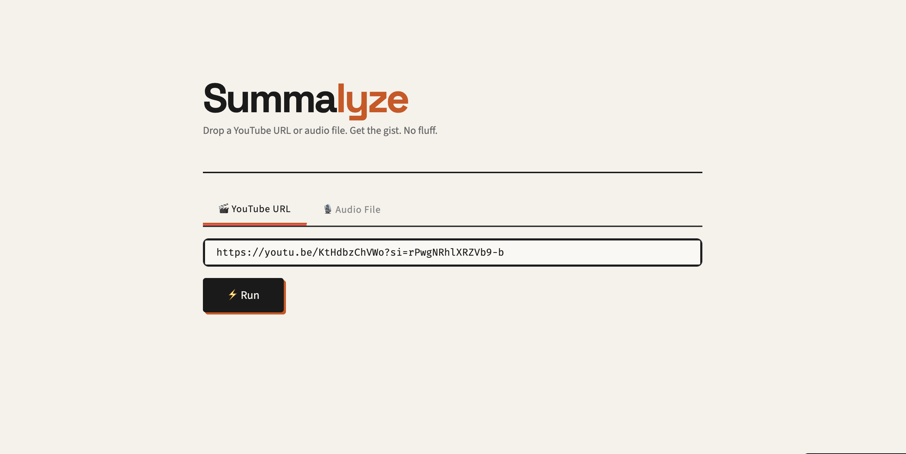

# ⚡ Summalyze

Drop a YouTube URL or audio file. Get the gist. No fluff.

🔗 **Live App:** [summalyze-yt.streamlit.app](https://summalyze-yt.streamlit.app/)

---

### App Interface


---

## Features
- 🎬 YouTube URL summarization (via transcript API)
- 🎙️ Audio file upload summarization
- 🔊 Summary read back as audio

## Stack
| Layer | Tool |
|---|---|
| Transcript fetch | youtube-transcript-api |
| Transcription | Whisper (local) |
| Summarization | Groq / llama-3.1-8b |
| Text-to-speech | gTTS |
| UI | Streamlit |

## Run locally
```bash
pip install -r requirements.txt
streamlit run app.py
```